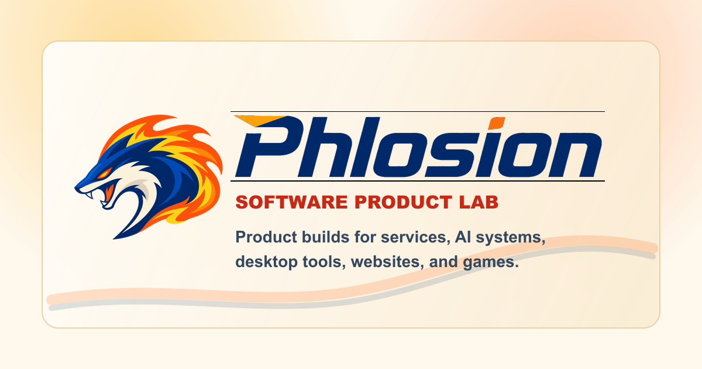
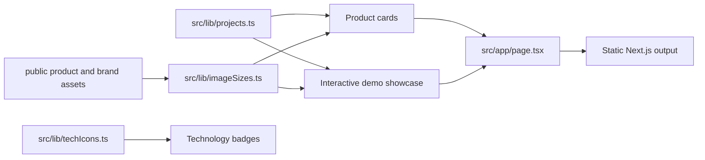

# 🔥 Phlosion - Software Product Lab

Phlosion is a branded software product lab for Adam Wentworth's product-shaped software builds. It complements [adamwentworth.ca](https://adamwentworth.ca) by keeping the software itself in focus: what each project does, how it is built, where it can go next, and what kind of product surface it needs.

The site is a Next.js app that presents full-stack services, analytics systems, local AI work, desktop tools, web surfaces, and C++ game/runtime experiments through brand assets, product constraints, demo surfaces, repository evidence, and technical stack notes.

<p align="center">
  <a href="https://nextjs.org/"></a>
  <a href="https://react.dev/"></a>
  <a href="https://www.typescriptlang.org/"></a>
  <a href="https://tailwindcss.com/"></a>
  <a href="https://playwright.dev/"></a>
  <a href="https://vercel.com/"></a>
</p>

---

## 🖼️ Brand Surface

| Social card                                                    | Phlosion lockup                                                                 |
| -------------------------------------------------------------- | ------------------------------------------------------------------------------- |
|  |  |

Product brand assets live in `public/products/`, Phlosion site-brand and social assets live in `public/brand/`, and linked-site assets live in `public/sites/`.

---

## 📦 App Structure

```plaintext
Phlosion/
|-- public/
|   |-- brand/                 # Canonical Phlosion mark, wordmarks, lockups, and social card
|   |-- products/              # Product-specific logos, wordmarks, screenshots
|   |-- sites/                 # Brand assets for linked web builds
|   `-- tech/                  # Local technology logos used by badges
|-- scripts/
|   |-- generate-phlosion-lockups.mjs
|   |-- generate-social-card.mjs
|   `-- optimize-media.mjs
|-- src/
|   |-- app/                   # Next.js App Router page, metadata, global styles
|   |-- components/            # Product showcase, brand frames, badges, details UI
|   `-- lib/                   # Product catalog, image sizes, technology icons
|-- package.json               # Scripts and dependencies
|-- next.config.ts
`-- README.md
```

This is intentionally a compact single-app repo. The product depth comes from structured content, branded media, and UI sections rather than separate backend services.

---

## 🧰 Tech Stack Overview

| Layer     | Tech                                     | Notes                                                                  |
| --------- | ---------------------------------------- | ---------------------------------------------------------------------- |
| Framework | Next.js App Router                       | Static portfolio/product-lab site with route metadata                  |
| Frontend  | React, TypeScript                        | Product cards, interactive demo selector, responsive UI                |
| Styling   | Tailwind CSS, custom CSS modules         | Global tokens plus section-specific styles under `src/app/styles/`     |
| Media     | Next Image, Sharp                        | Registered image dimensions, generated social card, media optimization |
| Icons     | Lucide React, simple-icons               | Product-type icons, action icons, and technology badges                |
| Quality   | Prettier, ESLint, TypeScript, Next build | `npm run verify` runs the main local gate                              |
| Hosting   | Vercel                                   | Production target for `phlosion.com`                                   |

The repo keeps product data in TypeScript rather than a CMS so project copy, stack groups, brand paths, demo metadata, and repository signals stay reviewable in one place.

---

## ✨ Product Surface

- **Product catalog**: software apps and tools are modeled in `src/lib/projects.ts` with status, audience, stack groups, proof points, next steps, repository signals, and brand assets.
- **Branded product cards**: each product gets a themed card, product-type icon, stack badges, expandable detail sections, demo link, and repository link.
- **Interactive demos**: the showcase section switches between product-specific demo visuals for collection/trade flows, analytics dashboards, desktop tools, audio workflows, assistants, and game/runtime prototypes.
- **Site builds**: Phlosion also tracks web surfaces like AdamWentworth.ca and Phlosion.com as software products with their own delivery constraints.
- **Media system**: product logos, wordmarks, screenshots, and local technology marks are kept in `public/` and mapped through `src/lib/imageSizes.ts`.
- **Rights-aware framing**: fan/community and analytics projects are clearly labeled as portfolio, learning, analytics, or support work.

---

## 🧭 Product Catalog

| Product              | Track                          | Stack highlights                                        |
| -------------------- | ------------------------------ | ------------------------------------------------------- |
| Pokemon Go Nexus     | Collection and trade app       | React, TypeScript, Expo, Go, Kafka, MySQL, PostGIS      |
| WinRift              | Game analytics app             | React, TypeScript, Vite, Go, ClickHouse, Riot API       |
| Track Extract        | Audio separation desktop app   | React, TypeScript, Tauri, Rust, Python, Demucs, FFmpeg  |
| Pokemon Autochess    | Game/runtime prototype         | C++20, CMake, SDL2, OpenGL, Direct3D 12, Lua            |
| Jarvin               | Local AI assistant system      | Python, FastAPI, SQLite, llama.cpp, Ollama, Whisper ASR |
| BinderLedger         | Collection and market app      | Expo, TypeScript, Go, PostgreSQL, OpenCV, Tesseract     |
| Cipher Snagem Editor | Cross-platform desktop tooling | .NET, AvaloniaUI, C#, Windows/Linux release packaging   |
| AdamWentworth.ca     | Resume site build              | Astro, TypeScript, CSS, Vercel                          |
| Phlosion.com         | Product-lab site               | Next.js, TypeScript, Tailwind CSS, Vercel               |

---

## 🚀 Getting Started

### 1. Install Dependencies

```bash
npm install
```

### 2. Start Local Development

```bash
npm run dev
```

Open:

- Local site: `http://localhost:3000`

### 3. Build Production Output

```bash
npm run build
```

---

## 🧪 Local Checks

| Command                | Purpose                                      |
| ---------------------- | -------------------------------------------- |
| `npm run format`       | Format the repo with Prettier                |
| `npm run format:check` | Verify formatting without writing            |
| `npm run lint`         | Run ESLint                                   |
| `npm run typecheck`    | Run TypeScript without emit                  |
| `npm run build`        | Compile the production Next.js app           |
| `npm run verify`       | Run format check, lint, typecheck, and build |

The normal pre-commit confidence path is:

```bash
npm run verify
```

---

## 🎨 Media Workflow

### Generate the Social Card

```bash
npm run generate:brand-lockups
npm run generate:social-card
```

The lockup generator writes blue and cream horizontal variants from the canonical mark and wordmark geometry. The social-card generator then writes `public/brand/phlosion-social-card.png` from the current Phlosion brand assets.

### Optimize Media

```bash
npm run optimize:media
```

Use this after adding or changing larger image assets. Product images should then be registered in `src/lib/imageSizes.ts` so Next Image can render them with stable dimensions.

### Refresh BinderLedger Demo Media

BinderLedger owns its read-only Playwright capture workflow in `apps/client`. It exports Phlosion-compatible desktop and mobile screenshots and WebM walkthroughs:

```powershell
Set-Location D:\Projects\Apps\BinderLedger\apps\client
npm run capture:demo:media
```

Review the generated `.artifacts/demo-media/binderledger/` package, then copy the selected manifest, screenshots, and videos into `public/products/binderledger/demo/`. The workflow reads catalog and market surfaces only; it does not mutate watchlists, collections, or scans.

---

## 🔁 Data Flow



The site has no runtime database. The product catalog, technology icon mapping, and image-size registry are the source of truth for the rendered product lab.

---

## 🧠 Content Model

`src/lib/projects.ts` defines the product catalog. Each project includes:

- `status`, `track`, `audience`, `labRole`, and `labTrack`
- delivery surface and product constraint copy
- proof points, repository signals, and next-step notes
- tag groups for technology badges
- repository URL and Lucide product-type icon
- brand image paths for icons, wordmarks, and lockups
- demo metadata for the interactive showcase

When adding a product, update:

1. `src/lib/projects.ts`
2. `public/products/<product>/`
3. `src/lib/imageSizes.ts`
4. Product-specific styles in `src/app/styles/products.css`, `sections.css`, `showcase.css`, and `responsive.css` when needed
5. `src/components/ProductShowcase.tsx` when the product needs a custom demo visual

---

## 🌐 Deployment

Phlosion is built for Vercel and served at [phlosion.com](https://phlosion.com).

Typical deployment flow:

1. Push to GitHub.
2. Vercel builds with `npm run build`.
3. The custom domain points to the Vercel project.
4. Social preview metadata uses `public/brand/phlosion-social-card.png`.

---

## 🔐 Rights And Affiliation Notes

Pokemon- and League-related projects shown on Phlosion are portfolio, learning, analytics, and community-support work. They are not affiliated with, endorsed by, or sponsored by Nintendo, Creatures, GAME FREAK, The Pokemon Company, Niantic, Riot Games, any data provider, or related rights holders.

Product screenshots and brand images that originate from individual project repos are included here to present those projects inside the Phlosion portfolio surface.

---

## 🧠 Author Notes

Phlosion is the product-lab layer around a broader software portfolio. AdamWentworth.ca explains background and experience; Phlosion keeps the projects themselves in view: the product idea, the engineering shape, the release path, and the work still needed to make each build more useful.
